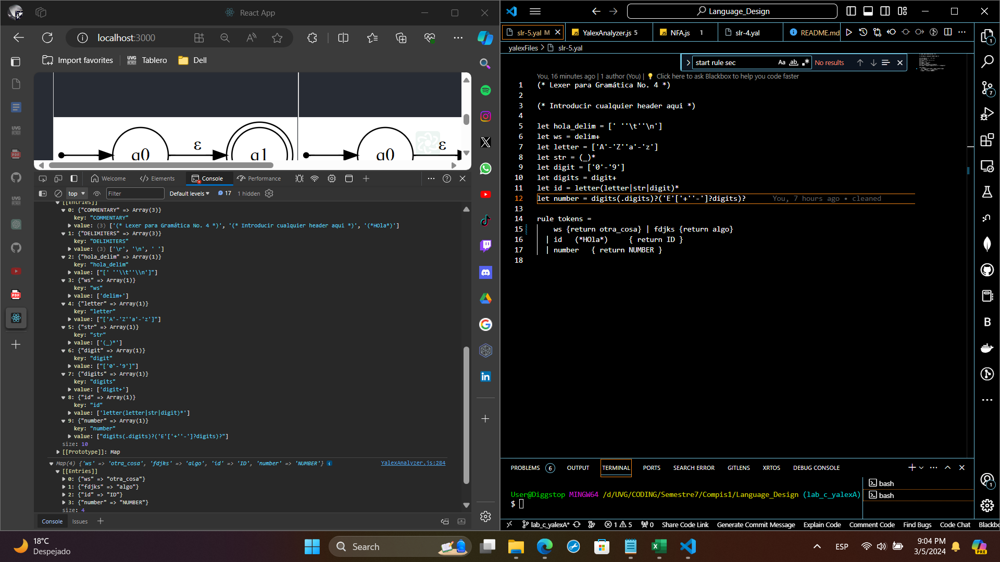
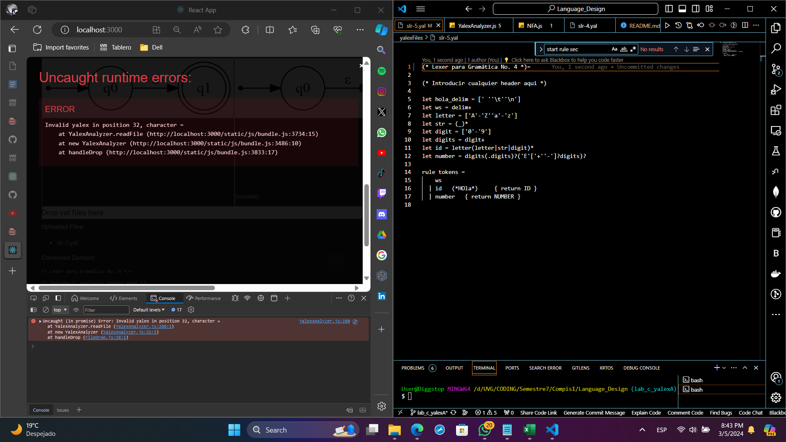
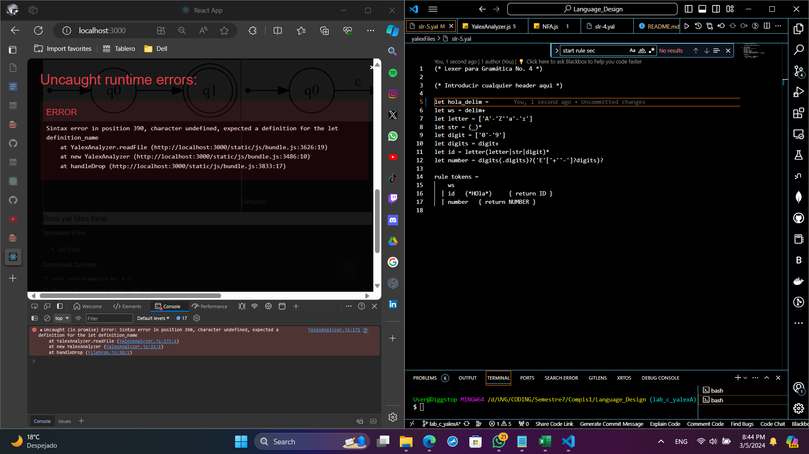
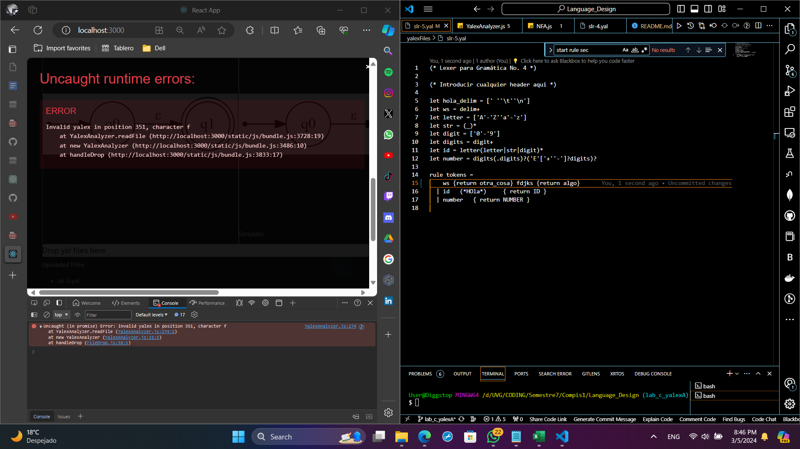
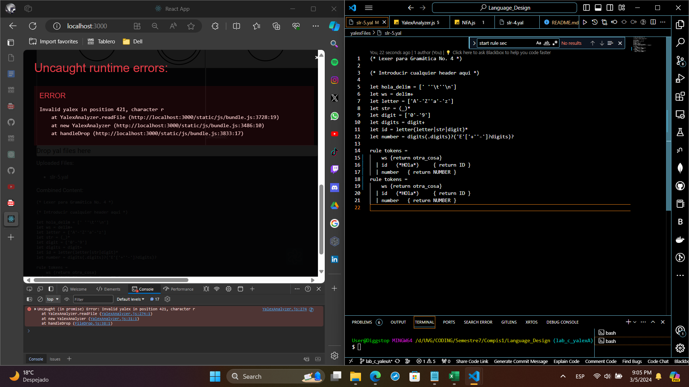

# Language_Design
Es el repositorio de diseño de lenguajes de programación, tiene el código de todo el curso.

## Regex a probar
- (a*|b*)c
- (b|b)*abb(a|b)*
- (a|ε)b(a+)c?
- (a|ε)b(a+)c?
- (a|b)*a(a|b)(a|b)
- b*ab?
- b+abc+
- ab*ab*
- 0(0|1)*0
- ((ε|0)1*)*
- (0|1)*0(0|1)(0|1)
- (00)*(11)*
- (0|1)1*(0|1)
- 0?(1|ε)?0*
- ((1?)*)*
- (01)*(10)*

## Yalex
En el caso del yalex se dividió por partes, la primera parte haría un análisis general del archivo yalex de manera que extraería los lets, los returns y los nombres de las variables, además de chequear errores.

### Análisis general del yalex
Estos serían los resultados sin modificar de esta parte:

* Yalex slr-5.yal:

* Yalex slr-4.yal:

* Yalex slr-3.yal:

* Yalex slr-2.yal:

* Yalex slr-1.yal:

Este sería el manejo de errores:

* Valores dónde no deberían de haber

* Algo que no está bien en la definición del let

* Definiciones sin definición:

* Para el return realizar dos returns sin separar por |:

* Hacer dos veces la declaración de reglas:

